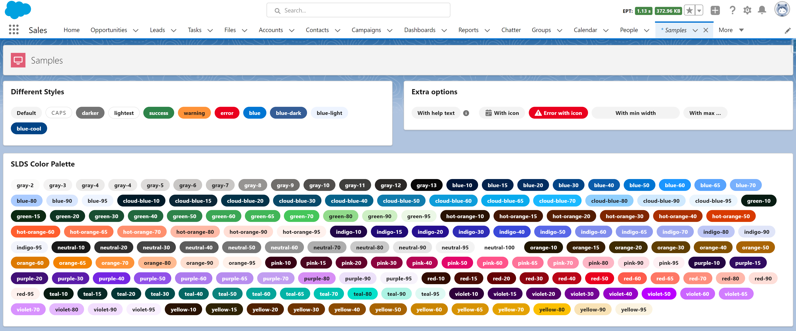

# LWC Badge TODO



## About

Generic SLDS LWC badge component

## Features
- Native SLDS Style: 
- Support all the SLDS variants
- Integrated on a single component (easy to copy to multiple projects)
- Supports function execution when clicking on a button
- New custom type (info) based on salesforce UI
- Slot support


## Instructions

### Use on your project
Everything was developed in a single LWC, so you just need a new single component on your project.

- Copy the following files to your project:
    - force-app/main/default/lwc/lwcBadge/**
- Call the component and pass the options
```
<c-
```

### Testing and learn how to use it

- Run the `createorg.sh` to create a scratch org
- Open the `LWC badge` lightning app
- Explore the code on the `samples` component
- Edit the page to preview on mobile devices or login with your mobile device (check the `password.env` file)


## References


